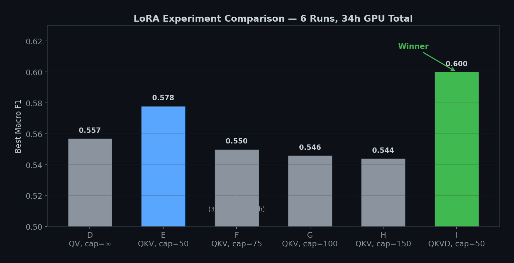
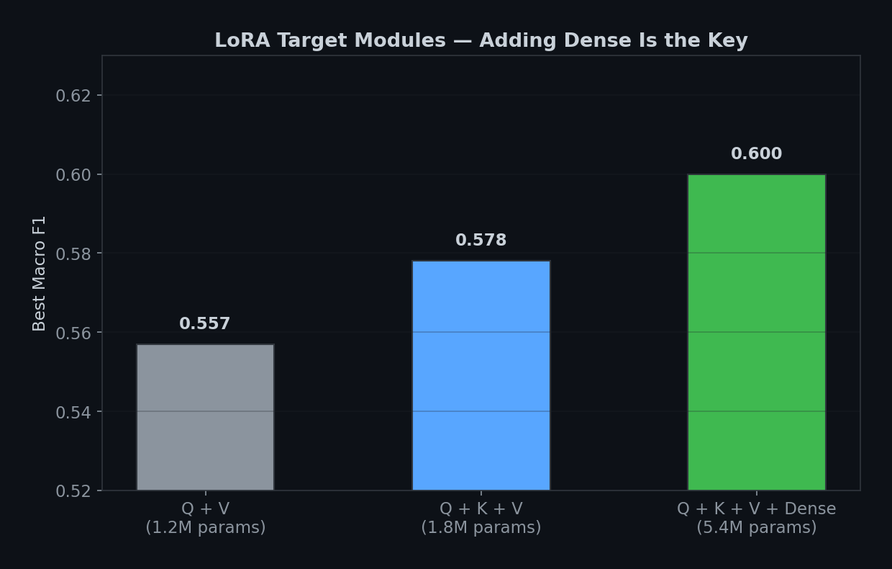
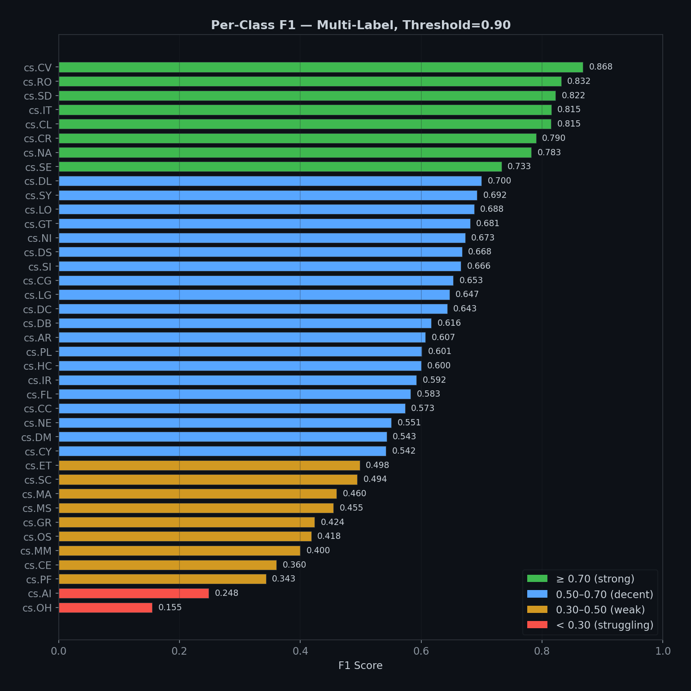
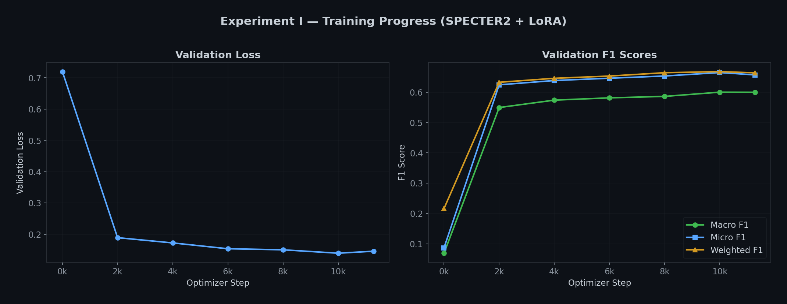
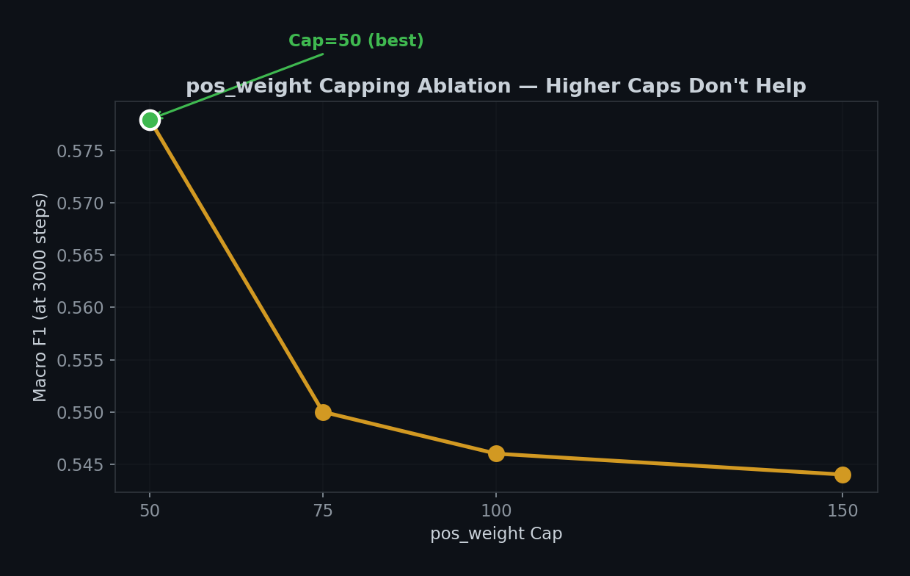
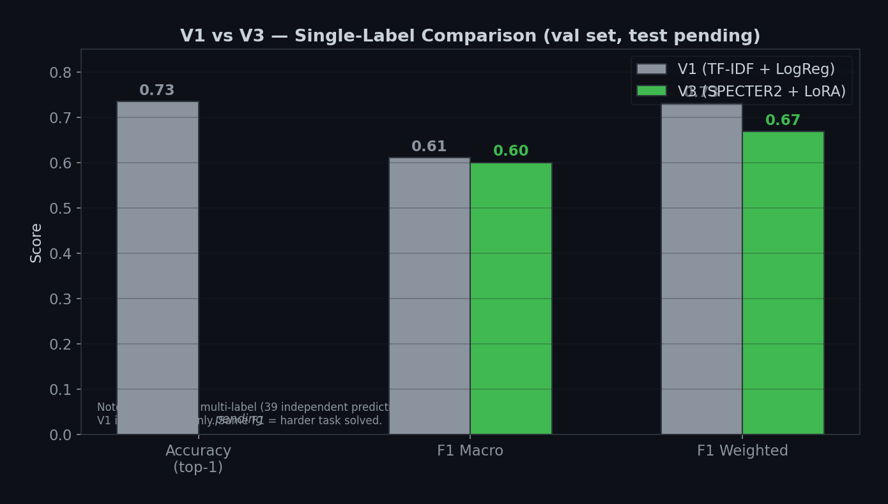

# arXiv Intelligence Search

**AI-powered search over 902,645 arXiv Computer Science papers.**

Classify papers into 39 CS categories, find semantically similar research, and ask citation-grounded questions — powered by SPECTER2, LoRA, FAISS, and RAG with Claude.

[**Try the live demo →**](https://huggingface.co/spaces/Bekkali037/arxiv-intelligence-search-demo)

---

## What This Project Does

A 3-tab Streamlit application that covers the full ML pipeline from data cleaning to production inference:

- **Classify** — Multi-label CS category prediction using a fine-tuned SPECTER2 + LoRA model with per-class confidence thresholds optimized on 90K validation papers.
- **Find Similar** — Semantic search over 902K paper embeddings using FAISS HNSW, returning results by meaning rather than keyword overlap.
- **Ask** — Retrieval-augmented Q&A where Claude Haiku generates answers grounded in retrieved papers, with numbered citations.

Built entirely on a laptop GPU (RTX 4060, 8 GB VRAM) over 80+ hours of experimentation.

---

## Results

### V1 vs V3

| | V1 (TF-IDF + LogReg) | V3 (SPECTER2 + LoRA) |
|---|---|---|
| Task | Single-label | Multi-label (39 classes) |
| Macro F1 | 0.61 | **0.62** (per-class thresholds) |
| Micro F1 | — | 0.71 |
| Weighted F1 | 0.73 | 0.72 |
| Top-1 accuracy | **73.5%** | 70.1% |
| Trainable params | ~780K | 5.4M (4.67% of 115M) |
| Multi-label | No | Yes |
| Semantic search | No | Yes |
| RAG Q&A | No | Yes |

V3 was not optimized for top-1 accuracy. The same Macro F1 on a multi-label task with 39 independent sigmoids represents a harder problem than single-label softmax classification.

### Multi-label Metrics (test set, 90,340 papers)

| Threshold strategy | Macro F1 | Micro F1 | Weighted F1 | Hamming Loss |
|---|---|---|---|---|
| Global 0.90 | 0.5956 | 0.6671 | 0.6515 | — |
| **Per-class (shipped)** | **0.6236** | **0.7136** | **0.7198** | **0.0237** |

Per-class thresholds improved Macro F1 by +0.028 over the global baseline.

### Per-class F1 (selected categories, per-class thresholds)

**Top performers:**

| Category | F1 | Threshold | Support |
|---|---|---|---|
| cs.CV | 0.887 | 0.77 | 18,734 |
| cs.SD | 0.838 | 0.95 | 2,032 |
| cs.RO | 0.831 | 0.90 | 5,140 |
| cs.CL | 0.818 | 0.87 | 10,548 |
| cs.IT | 0.815 | 0.90 | 5,358 |

**Rescued by per-class thresholds:**

| Category | F1 (global 0.90) | F1 (optimized) | Threshold |
|---|---|---|---|
| cs.AI | 0.248 | **0.551** | 0.58 |
| cs.LG | 0.647 | **0.752** | 0.61 |

Broad, ambiguous categories benefit from lower thresholds because the model is appropriately uncertain — these categories genuinely overlap with others.

---

## Experiment History

9 experiments over 80+ GPU hours on an 8 GB laptop GPU.

| Exp | LoRA targets | pos_weight cap | Best Macro F1 | Key finding |
|---|---|---|---|---|
| A–C | Various | Various | < 0.53 | Early exploration |
| D | Q, V | None (up to 695) | 0.557 | Uncapped weights miscalibrate probabilities |
| E | Q, K, V | 50 | 0.578 | Capping stabilizes training |
| F | Q, K, V | 75 | 0.550 | Higher caps don't help (3000-step proxy) |
| G | Q, K, V | 100 | 0.546 | Higher caps don't help (3000-step proxy) |
| H | Q, K, V | 150 | 0.544 | Higher caps don't help (3000-step proxy) |
| **I** | **Q, K, V, Dense** | **50** | **0.600** | **Adding feed-forward layers = biggest win** |

Experiment I details: 5.4M trainable params (4.67% of 115M), 34 hours training, peaked at step 10,000 (epoch 0.886).

### Key Learnings

1. **Where you put trainable params matters more than how many.** Adding LoRA to the feed-forward (dense) layers jumped Macro F1 from 0.578 to 0.600 — a bigger gain than going from Q+V to Q+K+V.
2. **pos_weight cap of 50 beats 75, 100, and 150.** Higher caps should help rare classes but actually miscalibrate probabilities. Validated by 3000-step proxy runs.
3. **Short proxy runs (3000 steps) reliably predict final rankings.** This saved dozens of GPU hours.
4. **Per-class thresholds rescue broad categories.** cs.AI went from 0.248 to 0.551 F1 by dropping its threshold from 0.90 to 0.58.

---

## Architecture

```
arXiv metadata (5 GB JSON)
  → CS-only cleaning & deduplication → 902,645 papers
    → V1: TF-IDF + Logistic Regression (single-label baseline)
    → SPECTER2 base embeddings (768-dim, 2.77 GB)
      → FAISS HNSW index (M=32, efConstruction=200, 3 GB)
        → Tab 2: Semantic search
        → Tab 3: RAG retrieval → Claude Haiku 4.5 → grounded answer
    → Multi-label stratified splits (721K / 90K / 90K)
      → SPECTER2 + LoRA fine-tuning → Tab 1: Classification
```

**Design decision:** The classifier (Tab 1) uses the fine-tuned SPECTER2 + LoRA model. The search and RAG (Tabs 2 and 3) use the base SPECTER2 model. These are intentionally different representation spaces — the base model was contrastive-trained for paper similarity, while the fine-tuned model was trained with BCE loss for classification. Different tasks, different models.

### Model Architecture

```
Encoder:    SPECTER2 (allenai/specter2_base, 110M params, frozen)
LoRA:       r=32, α=64, dropout=0.05, targets=query/key/value/dense
Classifier: Linear(768 → 39)
Pooling:    CLS token
Loss:       BCEWithLogitsLoss, pos_weight clamped to [1, 50]
Optimizer:  AdamW, lr=1e-4, weight_decay=0.01
Schedule:   Linear warmup (6%) + linear decay
Precision:  fp16
Input:      "title [SEP] abstract"
```

---

## Charts

<p align="center">
  
  
</p>
<p align="center">
  
  
</p>
<p align="center">
  
  
</p>

---

## Repository Map

```
.
├── app.py                         # Streamlit app (3 tabs)
├── pyproject.toml                 # Dependencies (uv-managed)
├── .env.example                   # Anthropic API key template
│
├── src/arxiv_intel/
│   ├── classifier.py              # V3 LoRA inference with per-class thresholds
│   ├── recommender.py             # SPECTER2 + FAISS semantic search
│   ├── rag.py                     # RAG pipeline (retrieval + Claude)
│   └── links.py                   # arXiv URL helpers
│
├── scripts/
│   ├── prepare_multilabel_data.py # Multi-label stratified splits
│   ├── embed_papers.py            # SPECTER2 embedding generation
│   ├── build_faiss_index.py       # FAISS HNSW index construction
│   ├── train_lora_classifier.py   # LoRA fine-tuning
│   ├── evaluate_test.py           # Full test-set evaluation
│   ├── optimize_thresholds.py     # Per-class threshold optimization
│   └── generate_charts.py         # Visualization generation
│
├── notebooks/                     # Data prep, EDA, V1 baseline
├── charts/                        # Generated experiment visualizations
├── docs/                          # Architecture, methodology, artifact docs
└── models/                        # Tracked metadata (large artifacts gitignored)
```

---

## Quickstart

```bash
git clone https://github.com/MedBekkali/arxiv-intelligence-search.git
cd arxiv-intelligence-search
uv sync
cp .env.example .env               # Add your ANTHROPIC_API_KEY
streamlit run app.py
```

The app requires local artifacts (embeddings, FAISS index, LoRA checkpoint) that are too large for GitHub. Regeneration order:

```bash
python scripts/prepare_multilabel_data.py
python scripts/embed_papers.py          # ~2h on GPU
python scripts/build_faiss_index.py     # ~10min
python scripts/train_lora_classifier.py # ~34h on RTX 4060
```

---

## Artifact Note

Large generated files are excluded from GitHub:

| Artifact | Size |
|---|---|
| Raw arXiv metadata | ~5 GB |
| Cleaned CS parquet | ~655 MB |
| SPECTER2 embeddings | 2.77 GB |
| FAISS HNSW index | ~3 GB |
| LoRA checkpoint (Exp I) | ~22 MB |

Small metadata (`v1_metrics.json`, `v3_categories.json`) is tracked. See [docs/artifacts.md](docs/artifacts.md) for the full artifact inventory.

---

## Live Demo

The [HuggingFace Space](https://huggingface.co/spaces/Bekkali037/arxiv-intelligence-search-demo) runs the V3 classifier on CPU. The full app with semantic search and RAG requires ~6 GB of artifacts that are available locally.

---

## Tech Stack

- **Embeddings:** SPECTER2 (allenai/specter2_base)
- **Fine-tuning:** LoRA via PEFT
- **Vector search:** FAISS HNSW
- **RAG generation:** Anthropic Claude Haiku 4.5
- **Frontend:** Streamlit
- **Training:** PyTorch, fp16, RTX 4060 Laptop (8 GB VRAM)
- **Environment:** Python 3.12, uv

---

## Documentation

- [docs/architecture.md](docs/architecture.md) — System pipeline and module architecture
- [docs/methodology.md](docs/methodology.md) — Dataset, splits, metrics, evaluation discipline
- [docs/artifacts.md](docs/artifacts.md) — Generated files, sizes, regeneration sources
- [docs/embed_papers_walkthrough.md](docs/embed_papers_walkthrough.md) — SPECTER2 embedding walkthrough
- [docs/prepare_multilabel_data_walkthrough.md](docs/prepare_multilabel_data_walkthrough.md) — Multi-label data prep walkthrough

---

## Author

**Mohamed Bekkali** — ESAIP Angers, AI specialization.
Looking for an ML/AI alternance starting September 2026.

[GitHub](https://github.com/MedBekkali) · [LinkedIn](https://linkedin.com/in/mohamedbekkali) · [Live Demo](https://huggingface.co/spaces/Bekkali037/arxiv-intelligence-search-demo)